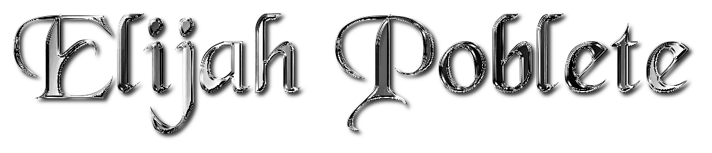

  

<h2 align="center">💫 About Me</h2>

  🔭 I am currently studying Bachelor of Science in Information Technology 
  👯 I am Studying in Cavite State University - Naic, Cavite 
  🤝 I’m looking for a way to connect with other developers 
  💬 Feel free to ask me about anything!

<h2 align="center">🌐 Socials</h2>

  
  
  
  

<h2 align="center">💻 Tech Stack</h2>

  
  
  
  
  
  

<h2 align="center">📊 GitHub Stats</h2>

  

  

  

<h2 align="center">🏆 GitHub Trophies</h2>

  

<h2 align="center">✍️ Random Dev Quote</h2>

  

<h2 align="center">🔝 Top Contributed Repo</h2>

  

<h2 align="center">💰 You can help me by Donating</h2>

  

<h2 align="center">🐍 GitHub Snake</h2>

  <picture>
    <source media="(prefer-color-scheme: dark)" srcset="https://raw.githubusercontent.com/ElijahPoblete/ElijahPoblete/output/github-snake-dark.svg" alt="GitHub Snake" />
    <source media="(prefer-color-scheme: light)" srcset="https://raw.githubusercontent.com/ElijahPoblete/ElijahPoblete/output/github-snake.svg" alt="GitHub Snake" /> 
    
  </picture>
